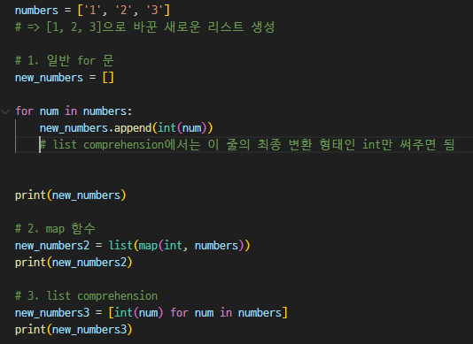
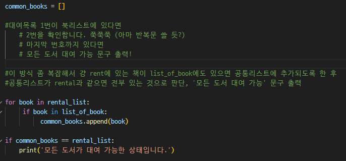

1. 들어가기 전에...
   - dict 내의 여러 요소 가져오는 법은 `dict_name[key][다음key]...`
2. 무작위 유저 정보 요청 경로: `API요청이름 = url`
3. API 요청: `requests.get(API요청이름)`

4. 모듈 가져오기
   - `from A import B` : A라는 패키지/모듈에서 B라는 모듈/함수(또는 변수)를 가져오겠다.
   - 다른 패키지X의 모듈Y에서 Z함수(또는 변수) 불러오기: `from X.Y import Z`
   - `import C as D` : C라는 모듈/함수를 D라는 이름으로 쓰겠다. 
5. 새로운 리스트 만드는 법
   - 
6. 리스트 안 10개의 딕셔너리에서 'name' value값만 가져오기
   - `for i in range(10)` -> in 다음에 값이 포함된 리스트명이 올 수도, 범위값이 올 수도 있다. 둘 다 iter 이기 때문!
   - 설정한 다른 리스트에 값 넣기: 먼저 빈 리스트 선언 `emtpy_list = []`후 `for`문과 `append`로 해결할 수 있다. 
   - `for i in range(10)`
     - `empty_list.append(원래data[i]['name])`
     - `print(empty_list)`하면 되어 있음!
     - `어디에.append(무엇을)` = 앞에 있는 곳에 넣겠다. 
7. 두 리스트 비교하기
   - list1 == list2 # True, False
   - 리스트가 정렬되지 않은 상태라면 False가 나올 수 있다! 그땐 `sorted()`를 통해 비교가능 `sorted(list1)==sorted(list2)`
8. 두 리스트에 공통적으로 들어있는 요소 새로운 리스트로 정리하기
   - common = []
   - for compo in list11:

            if compo in list22:
                common.append(compo)
    
9.  멤버십 연산자 : in /  not in
10. list 요소 하나하나씩 출력하고 싶다면! **for**을 써랏!
    - 진짜 레전드.. 신세계.. `for 요소이름아무거나 in 데이터타입` 하고 `print(요소이름아무거나)`하면 쪼로록 출력된당 
1.  