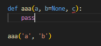

1. 들어가기 전에...
   - dict, params 같은 거 쓸 때 콤마, 콜론: 주의ㅊ
   - 출력시 print()가 아닌 `pprint.pprint()`로 하면 세로 모양으로 이쁘게 쭉쭉쭉 나와욥
2. f-string
   - str과 다른 요소를 한 `` 안에 적을 수 있음. 연산자 불필요
   - 들어가는 변수는 연산이 다 마친 상태여야 하는듯
   - 
3. 기본 인자와 위치 인자
   - 기본 인자는 위치 인자 앞에 위치할 수 없다. 
   - 
   - 위 경우 'b' 인자가 어디에 들어가는지 python이 구분할 수 없기 때문.
4. API
   - 공식 문서를 통해 함수에 더 정의해줘야 하는 **필수변수** 확인!
   - 요청변수 ID가 key를 의미하며, 해당 이름으로 맞춰서 보내줘야 한다. 
   - `API_KEY, URL`과 같은 상수는 대문자로 써주는 버릇 들일 것
5. `request.get(url)`
   - 해당url로 요청.답받겠다. 
   - 200번대 나오면 잘 받은 것.
   - 껍질 벗기려면 뒤에 `.json()`붙이면 된다. request가 제공하는 변환법
6. 요청url 
   - ?를 기준으로 `앞에는 기본 url` ? `요청변수 키=value& 의 반복`
   - 뒷부분을 계속해서 바꿀 필요 없이, 뒷부분 변수들은 param이라는 dict로 따로 묶어서 key:value 처리하면 좋다.
   - 이때 get(url, `params=params`).json() 이렇게 한번만 언급해주면 됨
7. pprint
   - 모듈 이름과 모듈 안 함수 이름이 동일하다. 따라서 `pprint.pprint()`로 사용
   - 만일 두번 쓰는 게 귀찮다면, 글로벌 변수에 `from pprint import pprint`를 적어주면 한번만 써도 됨.
   - 
8. 딕셔너리 값 접근 방식 비교
   - `print(stock[price])` 는 찾는 키가 없다면 `에러`가 발생
   - `print(stock.get('price'))` 찾는 키가 없다면 `None`이 발생 -> 이렇다면 그 키가 없다는 걸 알려주는 단서이기 때문에 이를 활용하여 다른 결과값을 도출할 수 있다. 
   - `print(stock.get('price','대체텍스트'))`라고 적으면 price 값이 없을 경우 텍스트가 출력됨
9.  